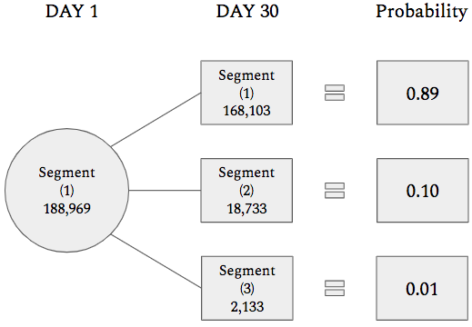
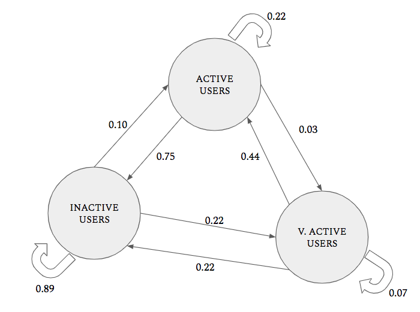
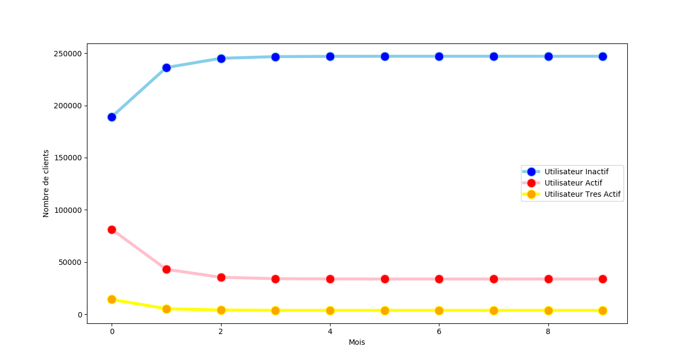
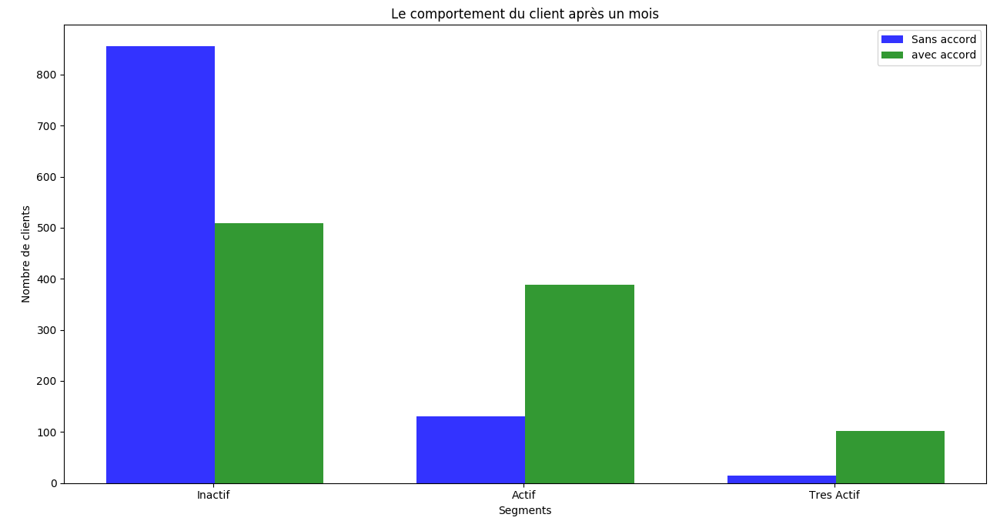

# Comment créer un simulateur de marché à l'aide de chaînes de Markov et de Python ?

# Traitement de l'information 
Pour cette analyse, on utiliserai les données analytiques de n'importe quel site web 
le dataset devrait suivre une structure similaire à celle ci-dessous. 

| USER ID | ACTION 1 | ACTION 2 | PAGE VIEWS |
|---------|----------|----------|------------|
| 1101    | 1        | 0        | 11         | 
| 1102    | 0        | 0        | 54         |
| 1103    | 1        | 1        | 3          |
          
Des exemples d'action peuvent être «offre / annonce cliquée», «abonnement cliqué», etc.

# Segmentation de la clientèle
Sélectionnez un jour particulier dans votre dataset et obtenez des données sur les nouveaux utilisateurs
pour un jour particulier. Par exemple :

| USER ID | JOUR     | STATUS   | ACTION 1   |
|---------|----------|----------|------------|
| 1101    | 1        | NEW USER | 1          | 
| 1102    | 1        | NEW USER | 0          |
| 1103    | 1        | NEW USER | 1          |

Vous pouvez ensuite diviser la distribution en 3 segments (inactif, actif et très actif)
en fonction de votre heuristique.

| USER ID | JOUR     | STATUS   | ACTION 1   | SEGMENTS |
|---------|----------|----------|------------|----------| 
| 1101    | 1        | NEW USER | 1          | 1        |
| 1102    | 1        | NEW USER | 0          | 3        | 
| 1103    | 1        | NEW USER | 1          | 2        |

après segmentation sur les données du premier jour:
 - 1 = utilisateur inactif
 - 2 = utilisateur actif 
 - 3 = utilisateur très actif
 
 Appliquer la segmentation à ces données après 30 jours. Assurez-vous de tenir compte du délai 
(par exemple, faites la moyenne de votre score d'engagement pour les 30 jours).
 
| USER ID | JOUR     | ACTION 1 | ACTION 2   | SEGMENTS |
|---------|----------|----------|------------|----------| 
| 1101    | 2-30     | 2        | 1          | 1        |
| 1102    | 2-30     | 32       | 28         | 3        | 
| 1103    | 2-30     | 9        | 10         | 2        |

# Preparation de la chaine de Markov
Voyons d'abord si notre système satisfait les hypothèses d'un modèle de Markov:
 - Il existe un ensemble fini d'états. Dans notre système, seuls 3 segments de clients peuvent entrer et sortir.
 - Les probabilités de se déplacer entre les états sont fixes. Donc Recurrent non nul.
 - Accessibilité de l'État. Les utilisateurs de n'importe quel segment peuvent passer à un autre segment sans aucune restriction externe. Donc Irreductible .
 - Non cyclique. Le mouvement de segment à segment n’est en aucun cas «automatique» dans notre système, Donc Aperiodique.
 
Notre système fonctionne bien contre la plupart des hypothèses de la chaîne de Markov. 
Cela nous donne une certaine confiance dans nos estimations de modèle, que nous obtiendrons
une fois que nous aurons construit le modèle.

# Construire la chaîne de Markov
De nos mouvements de segments enregistrés. Nous examinons comment les utilisateurs de chaque segment
le jour 1 sont passés à divers segments après 30 jours et calculons les probabilités en conséquence.

   
   
   
De nos mouvements de segments enregistrés. Nous examinons comment les utilisateurs de chaque segment le jour 1 
sont passés à divers segments après 30 jours et calculons les probabilités en conséquence.   
0,89 (dans l'image) fait référence à la probabilité qu'une personne du segment 1 le jour 1 reste dans le même 
segment après 30 jours, c'est-à-dire la probabilité qu'un utilisateur inactif reste inactif après 30 jours.
 Nous répétons ce processus pour tous les segments et construisons la matrice de transition finale:
   
                                              1     2     3
                                          1  0.89  0.10  0.01       1= Inactif
                                          2  0.75  0.22  0.03       2= Actif
                                          3  0.49  0.44  0.07       3= Tres Actif  
 
  
  
  Enfin, nous avons mis tout cela ensemble dans cette belle forme:
                          
                    1     2     3
                1  0.89  0.10  0.01       188.969       236.162
                2  0.75  0.22  0.03   *   081.356   =   043.048
                3  0.49  0.44  0.07       014.210       005.325
  
# Tracer les résultats
Commençons par tracer la tendance de notre mouvement client compte tenu de notre chaîne Markov.(Vérifiez le code
 
 
 
 Que pouvons-nous en déduire?
 Nous voyons qu'après une période d'environ 2 mois, les trois segments atteignent un équilibre, 
 c'est-à-dire que pendant que les utilisateurs se déplacent d'un segment à l'autre, le nombre total de
 clients dans chaque segment reste constant.
 # Changement a l'etat initial
 Supposons que vous possédez un service de pizza et que votre site Web propose une offre d'achat-2-obtenez-1-gratuit le 1er décembre. Vous pensez que ce changement introduira de nombreux utilisateurs plus actifs qui visitent votre site Web. Vos hypothèses sont confirmées lorsque vous obtenez un millier de nouveaux visiteurs uniques, dont 300 achètent en fait de la pizza (utilisateurs très actifs) ce même jour. Vous êtes agréablement surpris et pensez "hmmm j'ai l'habitude de recevoir 100 commandes par jour: comment cela se passera-t-il dans un mois". Il vous suffit d'ajuster l'état initial dans la chaîne de Markov pour tenir compte de ce changement.
 
 
 
 Du changement de l'état initial de (inactif = 500, actif = 400, très actif = 100) à (100, 600, 300), nous obtenons les résultats ci-dessus. Avec des utilisateurs plus actifs et très actifs au début du mois, vous augmentez vos chances d'avoir plus de clients réguliers pour la durée du mois.
 
 
 
 
 
